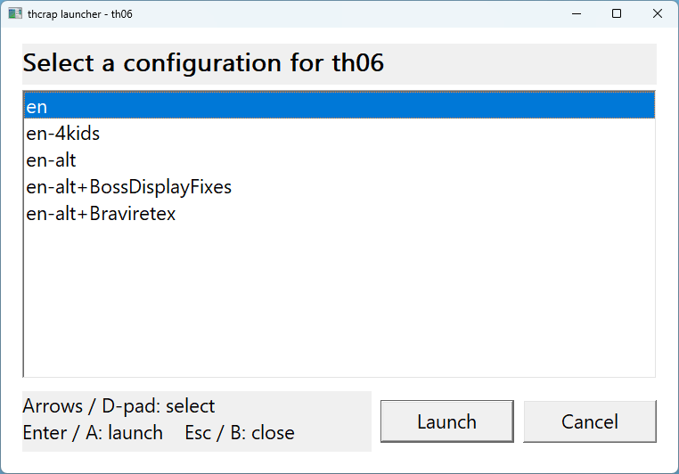

# thcrap-menu

A tiny Windows menu for [thcrap](https://github.com/thpatch/thcrap).



Instead of making a separate shortcut for every thcrap config, make one
shortcut for a game. When you launch it, this menu lets you pick which config
to use with the mouse, keyboard, or controller.

This was made with Steam Deck / Proton in mind, but it also works as a normal
Windows program.


## Quick Setup

1. Download `thcrap_menu.exe`.
2. Put it in your thcrap folder, next to `thcrap_loader.exe`.
3. Rename or copy your config files so each game has its own prefix.
4. Make one shortcut per game.
5. Launch the shortcut and pick a config from the menu.

The only trick is the config prefix. For example, if you want a Touhou 6 menu,
name the config files like this:

```text
config\th06;en.js
config\th06;en-alt.js
config\th06;jp.js
```

Then run the menu with:

```text
thcrap_menu.exe th06 th06;
```

The menu will show:

```text
en
en-alt
jp
```

When you pick one, it starts `thcrap_loader.exe` for that game and config.

In the examples above:

- `th06` is the game ID. This is thcrap's short name for Touhou 6.
- `th06;` is the config prefix. It is the text at the start of each config file
  that should appear in this menu.

You can choose a different prefix, but using the game ID plus `;` keeps the
files easy to recognize.


## Windows Shortcut

1. Right-click `thcrap_menu.exe`.
2. Choose **Create shortcut**.
3. Right-click the new shortcut and choose **Properties**.
4. In **Target**, keep the path to `thcrap_menu.exe`, then add the game ID and
   config prefix after it:

   ```text
   "C:\path\to\thcrap\thcrap_menu.exe" th06 th06;
   ```

5. Set **Start in** to your thcrap folder:

   ```text
   C:\path\to\thcrap
   ```

6. Rename the shortcut to something friendly, such as `Touhou 6`.

Repeat this once for each game you want in Steam or on your desktop. You do not
need a separate shortcut for every config.


## Steam Deck / Steam

These steps are easiest from Desktop Mode.

1. Put `thcrap_menu.exe` in your thcrap folder, next to `thcrap_loader.exe`.
2. Rename or copy your configs with the prefix you want, such as:

   ```text
   config\th06;en.js
   config\th06;en-alt.js
   ```

3. In Steam, choose **Add a Game** -> **Add a Non-Steam Game**.
4. Browse to `thcrap_menu.exe` and add it.
5. Open the new shortcut's **Properties**.
6. Set **Target** to the full path to `thcrap_menu.exe`:

   ```text
   "/home/deck/Games/thcrap/thcrap_menu.exe"
   ```

7. Set **Start In** to your thcrap folder:

   ```text
   "/home/deck/Games/thcrap"
   ```

8. Set **Launch Options** to the game ID and config prefix:

   ```text
   th06 th06;
   ```

9. Open **Compatibility**.
10. Check **Force the use of a specific Steam Play compatibility tool**.
11. Pick your preferred Proton version.

After that, launch it from Gaming Mode. The D-pad, A button, and B button should
work through Steam Input.


## Controls

- **Arrow keys / D-pad:** move
- **Enter / A:** launch selected config
- **Double-click:** launch selected config
- **Escape / B:** close the menu


## Config Names

The menu looks in thcrap's `config` folder for files that start with the prefix you
gave it.

For this command:

```text
thcrap_menu.exe th06 th06;
```

it looks for:

```text
config\th06;*.js
```

So `config\th06;en.js` appears in the menu as `en`.

If your config is currently named:

```text
config\en.js
```

rename or copy it to:

```text
config\th06;en.js
```

If you want the same config to appear for more than one game, copy the file and
give each copy a different prefix.


## Troubleshooting

### The menu says "Usage"

The shortcut is missing the two extra pieces at the end:

```text
thcrap_menu.exe <game_id> <config_prefix>
```

Example:

```text
thcrap_menu.exe th06 th06;
```

### The menu says "No configs matched"

The menu did not find any config files with that prefix.

Check that:

- `thcrap_menu.exe` is in the same folder as `thcrap_loader.exe`
- your config files are in the `config` folder
- the file names start with the prefix from the shortcut

For example, prefix `th06;` needs files like:

```text
config\th06;en.js
config\th06;anything-you-want.js
```

### Steam Still Says the Game Is Running

Steam may keep showing the game as running after all visible windows are closed.
This seems to be Steam/Proton tracking a thcrap or game process that the menu
started. Simply press B to abort.


## Command Line Details

Basic format:

```text
thcrap_menu.exe <game_id> <config_prefix>
```

Example:

```text
thcrap_menu.exe th06 th06;
```

If you pick `en`, the menu launches:

```text
thcrap_loader.exe "th06;en.js" "th06"
```


## Build

Most people do not need this section. This is only for building the executable
yourself.

With MinGW:

```sh
gcc -std=c11 -O2 -Wall -Wextra -mwindows -o thcrap_menu.exe thcrap_menu.c -lshell32 -lgdi32
```

The project also builds with MSVC. GitHub Actions builds a Windows executable
artifact on pushes and pull requests.


## Gamepad Support

Gamepad support uses XInput. You do not need to install anything extra for it.

If XInput is unavailable, mouse and keyboard controls still work.
